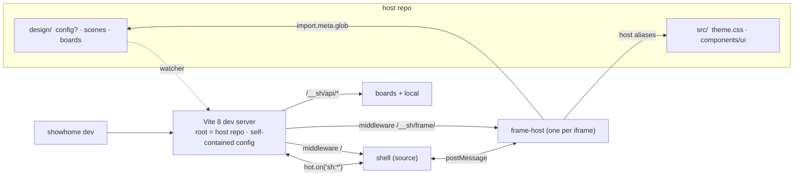

# Build spec v3 - the agent-native design canvas

> **Audience: the coding agent building this.** This is the implementation contract; product rationale lives in the pitch (v2.1). Working package name: **`showhome`** - one constant (`src/cli/name.ts`) plus a documented grep list (§2) for the places a bare constant cannot reach.
>
> Drop this file into the new repo as `SPEC.md`. When spec and convenience disagree, the spec wins; where the spec is silent, choose the boring option and record it in `DECISIONS.md`.
>
> Provenance: v2 validated against live repros (Vite 8 sandbox, measured Chromium behavior), then adversarially reviewed by Codex (55 findings; all P1s resolved in this revision). Sources inline where load-bearing.

---

## 0. Principles (non-negotiable)

1. **World-class UX through simplicity, not spend.** We are the anti pen.dev: they buy polish with the agent's tokens; we get it by being the native path.
2. **No AI in the tool.** No model calls, no keys, ever.
3. **The filesystem is the agent API.** No MCP. A frame needs **zero imports from this package** - markup in, pixels out.
4. **One writer per file class, at runtime.** The dev server/shell writes only `design/boards/*.json`, `design/manifest.json`, `design/.local/*`. `init` is the installer and writes scaffolds once (§10); after init, the runtime never touches scenes, screens, config, or `src/`.
5. **The host app's production build never executes or bundles `design/` code.** Dependency arrow: design → app, one way. (CSS note: the theme-wrapper strategy in §5.4 keeps the host's own CSS build untouched too.)
6. **Modes (`studio` | `embedded`) are conventions, not machinery.** Engine code never branches on mode.
7. **A crashing frame never crashes the board.** Precisely: *exception* isolation (render errors, module-load failures, unhandled rejections → error card). Same-thread realities - an infinite loop or memory bomb in a frame still janks the tab - are documented, not solved.
8. **Zero-config by convention.** `design/config.ts` optional; every field has a detected or conventional default.
9. **Uninstall = delete `design/`, remove the dev dependency, and (only if `init` added it) revert one `"design"` entry in the host tsconfig `exclude`.** `init` prints this exact sentence. Nothing else is ever touched.
10. **Browser support policy:** canvas dev surface targets Chromium first; Safari/Firefox are functional with documented cosmetic degradation (Safari blurs iframes under ancestor transforms). Published builds render at scale 1 and target all evergreen browsers.

*Positioning check (Aug 2026): the one live threat is `nexu-io/open-design` - agent-native, iframes over real files, but an Electron app. Our differentiation is being an npm dev dependency embedded in the repo. That gap closes the day they ship a headless CLI; move fast.*

---

## 1. Stack (validated, pinned)

| Concern | Choice | Why |
|---|---|---|
| Engine | **`vite@^8`** | Vite 8 (2026-03) ships Rolldown as the only bundler; `rolldown-vite` deprecated. |
| React plugin | **`@vitejs/plugin-react@^6`** | Standard; Fast Refresh on Oxc; hard peer on vite 8. **Added to our plugin array explicitly** (§5.1). |
| Canvas | **`react-zoom-pan-pinch` + hand-rolled drag/resize** | 12.5 kB gz, zero deps. xyflow's headline perf feature is unusable here (§7 G-2). Budget 400-600 loc incl. pointer capture. Flip back to xyflow only if edges/minimap/marquee become requirements. |
| Host aliases | **`resolve.tsconfigPaths: true`** | Built into Vite 8. |
| Config loading (node) | **native `await import()` of `.ts`** | Node type-stripping Stable. Engines: `node >= 22.18`, checked at CLI start. Sharp edges §4. |
| CLI | **`cac@7`** | ESM-only, zero deps, stable major. |
| Shell state | **`zustand@^5`** | 486 B, zero deps. |
| Package build | **`tsdown`** | tsup self-declares unmaintained. Node-side code only. |
| React | peer **`"^18.0.0 || ^19.0.0"`** + `resolve.dedupe: ['react','react-dom']` | Conventional range; never open-ended. |

**Complete dependency list: `vite`, `@vitejs/plugin-react`, `react-zoom-pan-pinch`, `zustand`, `cac`.** A sixth requires a DECISIONS.md entry explaining why it cannot be ~200 lines of our own code.

---

## 2. Package layout & publishing contract

```
showhome/
  package.json
  src/
    cli/   name.ts · index.ts (cac: init/dev/build) · init.ts        # BUILT (tsdown → dist/)
    server/ dev.ts · plugin.ts · routes.ts · api.ts · config.ts
            detect.ts · manifest.ts                                   # BUILT (tsdown → dist/)
    client/                                                           # SHIPS AS SOURCE
      shell/       index.html · main.tsx · App · canvas/ · panel/ · bridge.ts · tidy.ts
      frame-host/  index.html · main.tsx · bridge.ts (shared with html-inject)
      stage/       (M2)
      runtime/     index.ts   # go() sugar; exported as SOURCE
  templates/ common/ studio/ embedded/
```

**package.json contract (explicit - this is what `npm pack` ships):**

```jsonc
{
  "bin": { "showhome": "dist/cli.js" },
  "files": ["dist", "src/client", "templates", "README.md"],
  "exports": {
    "./runtime": "./src/client/runtime/index.ts",   // source; transformed by the host Vite instance
    "./package.json": "./package.json"
  },
  "peerDependencies": { "react": "^18.0.0 || ^19.0.0", "react-dom": "^18.0.0 || ^19.0.0" },
  "engines": { "node": ">=22.18.0" }
}
```

- tsdown entries: `src/cli/index.ts` (+ server files it imports). Nothing under `src/client` is built, ever.
- **Rename procedure** (documented in README): change `name.ts`, package.json `name`, then grep for the literal in: `optimizeDeps.exclude`, route prefix constant, templates, README. One constant + one grep; do not pretend it is less.
- **Why `client/` ships as source:** it contains `import.meta.glob('/design/**')`, expandable only by the host Vite instance (confirmed on Vite 8 from node_modules, including add/delete invalidation and `import.meta.hot` + custom WS events - so the shell needs no separate event channel). Two config lines make this true: `server.fs.allow` includes the resolved `packageDir`, and **`optimizeDeps.exclude: ['showhome']`**. The exclude claim is verified by the M0 packed-package test (§13), not taken on faith.

---

## 3. Runtime architecture & route serving



**The host's `vite.config.*` is never loaded.** Our instance is self-contained (own plugins, own root, own port); host plugins, proxies, and base paths cannot interfere. The only things inherited from the host are: tsconfig paths (via `resolve.tsconfigPaths`), the PostCSS config Vite discovers at root (Tailwind v3), and node_modules resolution. Record this as the first line of DECISIONS.md.

**Route serving is middleware, not magic** (`server/routes.ts`, registered in `configureServer` *before* Vite's HTML fallback). `transformIndexHtml` does not map URLs; we do:

| URL | Middleware behavior |
|---|---|
| `/` (and `/#/…`) | read `src/client/shell/index.html` from packageDir → `server.transformIndexHtml(url, html)` → serve. The host app's own `index.html` is unreachable on this port. |
| `/__sh/frame/` (query: `id`, `theme`) | same, with `frame-host/index.html` |
| `/__sh/stage/` (M2) | same, with `stage/index.html` |
| `/design/**/*.html` | Vite serves it; our plugin's `transformIndexHtml` hook injects the theme import + `bridge.ts` script |
| `/__sh/api/*` | §8 |
| everything else | fall through to Vite (module serving, HMR, `/design/manifest.json` as static) |

**Frame URL function** (single source of truth, used by shell and stage, base-aware for builds):
`frameUrl(node) = kind === 'html' ? `${base}${file}?theme=` : `${base}__sh/frame/?id=&theme=``.

---

## 4. Config - optional by design

```ts
// design/config.ts - OPTIONAL. Defaults shown; omit the file and everything works.
export default {
  mode: "studio",                       // templates/docs only; engine never reads it
  theme: "<detected>",                  // see §5.4 wrapper strategy
  viewports: { mobile: {width:390,height:844}, tablet: {width:768,height:1024}, desktop: {width:1280,height:800} },
  themes: ["light", "dark"],
  port: 5199,                           // strictPort false; print the actual port
}
```

Native `await import(pathToFileURL(...))`. Sharp edges documented in the scaffolded file header: erasable syntax only (no enums/namespaces), relative imports need extensions, tsconfig paths ignored here. Invalid/missing fields → defaults + one warning. Config change → print "restart to apply". Browser side gets the merged config via **`virtual:sh-config`**. `providers` and `_layout` are conventions, not config.

---

## 5. The Vite plugin (`server/plugin.ts`)

1. **`config` hook** returns a full self-contained config: `root = hostRoot` · `plugins: [react(), showhomeCore()]` · `server.port` (strictPort false) · `server.fs.allow`: **merge + dedupe** with defaults (never replace): `[...defaults, hostRoot, packageDir]` · `resolve.dedupe = ['react','react-dom']` · `resolve.tsconfigPaths = true` · `optimizeDeps.exclude = [NAME]` · `optimizeDeps.entries = [join(packageDir,'src/client/frame-host/index.html'), 'design/**/*.{tsx,jsx}']` (resolved from `packageDir`, never a hardcoded `node_modules/...` path - pnpm/workspace layouts differ; `entries` overrides html inference so the frame-host entry is listed explicitly).
2. **Virtual modules**: `virtual:sh-theme` (resolves per §5.4) · `virtual:sh-config`.
3. **HTML frames**: `transformIndexHtml` injects theme import + the same `bridge.ts` used by frame-host (data-goto listener, error reporter, `sh:ready`, `sh:set-theme` listener, interact-exit keys §6).
4. **Theme - the wrapper strategy (no host file is ever edited):**
   - `init` writes **`design/theme.css`**: `@import "<detected host theme css, relative>"; @source "./";` (v4) or just the `@import` (v3). `virtual:sh-theme` resolves to `design/theme.css`.
   - v4: our Vite adds `@tailwindcss/vite` when `tailwindcss@^4` is detected; `@source "./"` (relative to the wrapper, i.e. `design/`) guarantees scanning regardless of CWD or gitignore quirks. **The host's own CSS build is untouched → no design classes ship in the app bundle → principles 5 and 9 hold.**
   - v3: our instance supplies an **inline PostCSS config** (`css.postcss` = host tailwind config with `content: [...host.content, './design/**/*.{ts,tsx,html}']`). Host `tailwind.config` file untouched. If the host config cannot be loaded, warn with the manual line to add.
   - Nothing detected → `virtual:sh-theme` resolves to an empty stylesheet + a visible canvas banner "no theme configured".
5. **API middleware** + **routes middleware** (§3, §8).
6. **Watcher → manifest**: watch `design/scenes` and `design/components` only (ignore `boards/`, `.local/`, `manifest.json`, `.dist/` - prevents write loops). On add/unlink, or on change *only if the regex-extracted meta record differs*, regenerate (debounced 150 ms), write manifest when content hash changed, broadcast `server.ws.send('sh:manifest', manifest)`. Ordinary content edits ride HMR alone and never touch the manifest.

---

## 6. Frame host & bridge (`client/frame-host/`)

```ts
const frames    = import.meta.glob(['/design/scenes/**/*.{tsx,jsx}', '/design/components/**/*.{tsx,jsx}'])
const layouts   = import.meta.glob(['/design/scenes/**/_layout.{tsx,jsx}', '/design/components/**/_layout.{tsx,jsx}'])
const providers = import.meta.glob('/design/providers.{tsx,jsx}')
```

**Ids and reserved names:** id = path relative to `design/`, extension dropped, `scenes/` prefix dropped. `_`-prefixed files are infrastructure, never frames. `design/screens/**` is not globbed. **A scene may not be named `components` or `screens`** - manifest generation errors loudly on collision (this closes the `scenes/components/x` vs `components/x` ambiguity).

**Contracts (so no builder invents them):**
- Frame file: `export default` a React component (no props). Optional `export const meta = { title?: string, viewport?: keyof viewports, theme?: string }` - **object literal with literal values only**; anything else (computed, `as const`, spread) is ignored by the regex and the manifest simply omits meta. No error.
- `_layout.tsx`: `export default ({ children }: { children: ReactNode })`. Chain = every `_layout` on the path from the glob root to the frame's directory, **outermost = shallowest**. `design/scenes/_layout` wraps all scenes; `design/components/_layout` (optional) wraps galleries.
- `design/providers.tsx`: same signature; always outermost.

**Boot** (all in `main.tsx`, and the failure path is explicit): wrap the *entire* sequence - theme import, providers/layout/frame dynamic imports, render - in try/catch. Any rejection renders a plain-DOM error card (no React required) and posts `sh:error`. Then: set `data-theme` → resolve modules → render `providers(layouts…(<Frame/>))` inside an ErrorBoundary (same card + "copy for agent": path + message, one line) → post `sh:ready {id, meta}` → arm a nothing: the *shell* owns the 10 s ready-timeout (§7).

**Bridge (shared by TSX host and HTML injection):**
- capture-phase click on `[data-goto]` → `sh:go`
- `window.onerror` / `unhandledrejection` → `sh:error`
- `message` listener: `sh:set-theme` → set `data-theme` (no reload)
- **interact-exit forwarding**: `keydown Escape` → `sh:exit-interact`; `dblclick` → `sh:dblclick` (lets the shell restore the overlay / handle focus even while pointer events live inside the iframe)

**Navigation is attribute-first**: `data-goto="scene/frame"`, zero imports. `runtime`'s `go()` posts the same message; no-op outside an iframe. Unknown target → shell toast + no-op. Self-target → no-op.

### postMessage protocol (complete; shell validates `event.source` against registered contentWindows and drops unknown shapes)

| Direction | type | payload |
|---|---|---|
| frame → shell | `sh:ready` | `{id, meta?}` |
| frame → shell | `sh:error` | `{id, message, stack?}` |
| frame → shell | `sh:go` | `{target}` |
| frame → shell | `sh:exit-interact` | `{}` |
| frame → shell | `sh:dblclick` | `{}` |
| shell → frame | `sh:set-theme` | `{theme}` |

---

## 7. The shell - canvas engine

```
App (top-level ErrorBoundary + safe JSON parsing for manifest/boards/config - a bad file
     shows a banner, never a white screen)
 ├─ SidePanel   (floating, collapsible: boards / scenes / library)
 ├─ PillNav     (floating top-right: ◐ theme · zoom % · t tidy · ▶ play · ↗ share)
 ├─ Canvas      (react-zoom-pan-pinch TransformWrapper → #world)
 │    └─ FrameNode[]  (absolutely positioned; tag · iframe · overlay · handles · ContextBar)
 └─ Toasts
```

### The iframe laws (violating any is a rewrite; measured or spec-cited)

- **G-1 · Create once; never reparent; never unmount while on the board; never reorder.** Inserting an iframe (re)creates its browsing context in every engine. Therefore: one flat `#world` container; **the render array is append-only in insertion order and is never sorted** - stacking is `z-index`, visual order is position, and removal happens only when a node is deleted from the board. React `key` = the board node's `key` (below), nothing else.
- **G-2 · Culling hides, never unmounts.** IntersectionObserver with one-viewport hysteresis → `visibility:hidden`. Never hide the selected, interact-mode, or focused frame.
- **G-3 · No standing `will-change: transform`** on the pan container - it permanently blurs iframes (measured, non-recovering). Toggle on at gesture start, `auto` on idle, on the element rzpp transforms (verify rzpp does not re-apply its own; override if so).
- **G-4 · During any drag/resize/pan: `iframe { pointer-events: none }`** via a class on `#world` (pointer events die inside iframe documents).
- **G-5 · Scale from measured rects**: `scale = worldRect.width / world.offsetWidth`. Never from stored zoom.
- **G-6 · `transform: scale()` only in v1.** Documented cosmetics, not bugs: Safari ancestor-transform blur; native `<select>`/date-picker popups misplaced at non-1 zoom in every engine.

### Board nodes, not frames, live on boards

```jsonc
// design/boards/checkout-flow.json
{ "version": 1, "name": "checkout-flow", "auto": false,
  "nodes": [ { "key": "n_8f2k1", "frame": "checkout/filled", "x": 0, "y": 0, "w": 390, "h": 780, "theme": "light" } ] }
```

`key` is a short random id minted by whichever writer adds the node. **The same frame may appear on a board multiple times** - two nodes, two keys, e.g. mobile and desktop side by side. This is a feature, and it is why the React key must be the node key (G-1).

### Interaction model

- Overlay by default: click = select, drag = move. **Double-click = interact** (overlay off; real hover/click/typing). Exit interact: click outside, or `Escape` (arrives as `sh:exit-interact` from inside the frame).
- **Focus mode is entered via `f` or the ContextBar button only** (`#/f/<nodeKey>`, frame fills window at 100%, `esc` back). No double-double-click ladder - it cannot work across the iframe boundary and is gone.
- Resize: three handles (e, s, se), hand-rolled with `setPointerCapture` + `pointercancel`/`lostpointercapture`/`blur` cleanup (stuck-drag prevention is part of the acceptance test). Width ↔ iframe width 1:1; snap within 12 px of viewport widths; badge shows live width. `meta.viewport` sets initial size.
- Gestures: wheel = pan (non-passive listener, `preventDefault` on the canvas) · pinch / ctrl-or-⌘-wheel = zoom (macOS pinch arrives as ctrl-wheel) · space-drag = pan · **`t` = tidy** (⌘T is the browser's; never bind it) · `⌘K` jump (M1).
- Loading lifecycle: shell arms a **10 s timer per node**; no `sh:ready` → error card with a reload button (re-sets `iframe.src`). `sh:error` any time → error card.
- Selected: accent ring + ContextBar (`frame id · width ▾ · ◐ · ⧉ copy path · focus`).

### Board behavior

- `everything` is virtual (computed from manifest, grouped by scene) until first user edit **materializes a snapshot** of the current computed layout with a fresh base hash and `"auto": true` - meaning later new frames still auto-append to it (a materialized `everything` keeps its convenience; any other board never auto-gains nodes).
- WS `sh:manifest`: new frame → auto-append node on auto boards + toast; removed frame → node stays with a "file deleted" card until the user removes it (explicit beats magic).
- Tidy (`t`): pure function, rows per scene, 48 px gutter; unit-tested.

---

## 8. API & persistence

| Endpoint | Behavior |
|---|---|
| `GET /__sh/api/boards` | `[{name, sha256}]` |
| `GET /__sh/api/boards/:name` | `{board, sha256}` (404 clean JSON) |
| `PUT /__sh/api/boards/:name` | `{board, baseHash}` → 409 on hash mismatch: **disk wins** - shell reloads and toasts "board changed on disk - canvas layout reloaded" (only layout positions are at stake; frames are files and never lost) |
| `GET/PUT /__sh/api/local` | `design/.local/view.json`; no hash guard |

Hardening (all of it, none more): body limit 1 MB · malformed JSON → 400 `{error}` · board name must match `^[a-z0-9][a-z0-9-]*$` · resolved path must stay under `design/boards/` (no symlink escape: `realpath` check) · writes atomic via temp file + rename, with copy-fallback on Windows rename failure (`EEXIST`/`EPERM` retry-once-then-copy) · stray `*.tmp` cleaned at boot. Shell debounces writes 500 ms.

Manifest is **not** an API: cold load = `fetch('/design/manifest.json')`, updates = `sh:manifest` WS event. Meta precedence when sources disagree: **board node > runtime `sh:ready` meta > manifest regex**. Runtime meta never mutates persisted boards.

## 9. Manifest

```jsonc
{ "frames": [ { "id": "checkout/filled", "file": "design/scenes/checkout/filled.tsx",
                "kind": "tsx", "scene": "checkout", "title": "Checkout - filled", "viewport": "mobile" } ],
  "scenes": [ { "name": "checkout", "frames": 4 } ],
  "boards": ["everything", "checkout-flow"] }
```

No timestamps. Paths normalized to `/` on every platform. Reserved-name collision (§6) fails generation with a printed fix.

---

## 10. `init` (the installer - the one-time writer)

Detection: `components.json` (shadcn → theme CSS + ui alias + component list) · tailwind major · router (`react-router*` / `next` / none) · toaster (`sonner`/`react-hot-toast`) · host tsconfig.

One question (`--mode` to skip): studio [default] or embedded. `--no-demo` to skip the sample scene.

Writes (idempotent, never overwrites; every host-repo touch is a printed diff):

```
design/config.ts (commented defaults)   design/AGENTS.md        design/providers.tsx
design/theme.css (wrapper, §5.4)        design/tsconfig.json    design/.gitignore (.local/)
design/scenes/_layout.tsx               design/scenes/demo/{welcome,form,dark}.tsx
design/scenes/demo/_fixtures.ts         design/boards/.gitkeep
```

Host patches: **exactly one, conditional** - append `"design"` to tsconfig `exclude` *only if* the host `include` would otherwise sweep `design/` in. No Tailwind file edits (wrapper strategy). Then print: the port, the uninstall sentence (§0.9), "commit design/ - only .local/ is ignored", and the demo agent prompt. On a Next host, print the M3 caveat (§14.7) and continue.

Demo requirements: `form` contains a visible sub-768px reflow; a working shadcn `<Dialog>` when detected; one `data-goto` link between demo frames.

**AGENTS.md ships verbatim from v2** (frame contract, `_` rule, structure ladder, fixtures, orientation via manifest, one-way arrow, promotion recipe) with one addition under Rules: *"A scene may not be named `components` or `screens`."*

---

## 11. Stage (M2)

`/__sh/stage/?scene=…&start=…` - same globs, ONE frame at a time inside the persistent providers+layout chain. **Chain identity must be stable across swaps** (memoize the layout component array by path list; frames in different subdirectories legitimately remount their differing inner layouts, and that is correct behavior, not a bug). `data-goto`/`go` = state change wrapped in `document.startViewTransition` **when feature-detected at runtime** (never version-sniffed), else 200 ms crossfade. History stack; ←/→ walk board order; `esc` exits; `#/play/<scene>` deep-links.

## 12. `build` (M2) - the static adapter

`showhome build` → `vite build` → `design/.dist/` (gitignored), `--base`-aware, all URLs relative:

- Inputs: shell html, frame-host html, stage html. The frame-host keeps its query-string contract (`frame/index.html?id=…`) - static hosting needs no routes. All frame modules reachable from the globs are bundled (code-split per frame).
- **Data**: build generates `virtual:sh-data` (manifest + all boards, inlined). In `PROD`, the shell imports it instead of fetching, and all write paths (board saves, `.local`) are disabled - a published canvas is read-only by design. No API exists and none is needed.
- **HTML frames**: enumerated from the manifest, emitted as build inputs so the theme/bridge injection applies to the built copies; `frameUrl` resolves them relative to base.
- Publish: any static host; README documents Cloudflare Pages + Access on one page. No `publish` command in v1.

---

## 13. Milestones & acceptance gates

**M0 - prove the loop (1-2 focused days; the integration work is the work).** Order: cli+config → plugin+routes → frame-host → shell minimal → init minimal. DECISIONS.md exists from day one.

Automated in M0 (not manual): unit tests for tidy, config merge, manifest scan, screen↔world math, meta regex; **and the packed-package smoke** - script that runs `npm pack`, installs the tarball into a scaffolded Vite+react temp app, runs `init --no-demo` + `dev`, then asserts over HTTP: `/` is 200 and contains the shell root div; `/__sh/frame/?id=demo/welcome` is 200; the glob map lists the demo frames; a file `Write` triggers a WS `sh:manifest` within 2 s. This one script retires the four riskiest claims (packaging completeness, optimizeDeps.exclude, routing, glob-from-node_modules) on every CI run.

Manual exit checklist on the pilot:
1. `init && dev` → demo renders in host theme.
2. Agent adds a frame via `AGENTS.md` → appears without reload in <1 s. (Token cost is **pilot telemetry to record, not a gate** - it varies by harness.)
3. Hand-edit → HMR; delete → node shows "file deleted" card.
4. Drag demo/form across 768 px → visible reflow.
5. `throw` in a frame → error card, board fine. Break an import → same (boot-path catch).
6. Double-click → hover + `<Dialog>` work; `Escape` from inside the frame restores the overlay.
7. HTML frame renders themed; its `data-goto` pans to the target.
8. Same frame twice on one board at two widths - both live (node-key test).

**M1 - the vision (+1-2 days).** Boards CRUD + 409 + `.local` · PillNav/ContextBar + per-node theme/viewport · built-in theme frame (runtime `:root` introspection) · manifest live-add + auto boards · tidy + `⌘K` + focus mode · culling with hysteresis. Gate: 2 boards, 30 frames, light+dark side by side; **pan p95 frame time < 16 ms on an M-series laptop with 30 mounted frames** (measured, not vibed).

**M2 - shareable (+1-2 days).** `data-goto` end-to-end on canvas · stage + view transitions · static adapter build · publish docs. Gate: walk the demo flow on a phone from a Cloudflare Pages URL behind Access.

**M3 - hardening (later).** `check` (tsc -p design + optional Playwright bounds lint) · posters + iframe cap · comments · `sh:ready` manifest enrichment · settle-to-`zoom` raster pass · **Next shims** with an explicitly tiny surface: `next/link` → renders `<a>`, `next/image` → ``, `next/navigation`/`next/router` → stubs that throw a helpful "not supported in frames" error. Nothing more is promised.

---

## 14. Gotchas ledger

1. `optimizeDeps.exclude: [NAME]` - glob + HMR die silently without it; verified by the M0 smoke, not prose.
2. `optimizeDeps.entries`: resolve from `packageDir`; overrides html inference; list the frame-host entry.
3. The iframe laws G-1…G-6 (§7). G-1 includes **never sorting the render array**.
4. Theme wrapper strategy (§5.4): the host CSS build must stay byte-identical after `init`. Test it: build the pilot app before and after init and diff the CSS output.
5. React duplication: peer range + dedupe; caught by the packed smoke. Symptom: hooks error.
6. Native-TS config edges (§4).
7. Next hosts: partial until M3; `init` prints it; pilot on Vite.
8. Meta regex: literal-only, silent omission on anything else (§6).
9. Windows: `/` normalization everywhere; rename fallback (§8).
10. Monorepos: host root = nearest `package.json` containing `design/`; `--root` escape hatch.
11. Browser-drawn UI (`<select>`, date pickers) misplaced at non-1 zoom - docs note, no fix.
12. Interact-exit and dblclick must be *forwarded from inside frames* (§6 bridge) - shell-side listeners cannot see them.

## 15. Day-1 pilot script (Nic)

```bash
pnpm create vite pilot --template react-ts && cd pilot && pnpm i
pnpm dlx shadcn@latest init && pnpm dlx shadcn@latest add button card input dialog
pnpm add -D ./showhome-*.tgz
npx showhome init          # studio
npx showhome dev
# Claude Code: "Read design/AGENTS.md. Build an onboarding scene - welcome, form,
# done - mobile-first, using our components. Spawn a subagent per frame."
```

Record the session's token meter - that number becomes the economics evidence.

## 16. Deliberately deferred

Posters/thumbnails · comments UI · `publish` command · settle-to-`zoom` pass · Vue/Svelte frames · prop introspection · visual editing · realtime multi-user · Storybook import · writable published canvases. New ideas land here, not in code.
